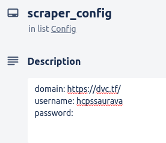

# ctfd-to-trello
CTFd scraper putting challenges onto Trello

## Installation
- Clone the repo
- pip install -r requirements.txt

## Usage
- Create a new board on Trello with a card called "scraper_config"
- The card description should be:

domain: [domain_url]
username: [your_username]
password: [your_password]

- Get a Trello API key and token, put them in .secret.yaml
- Run the program! 
